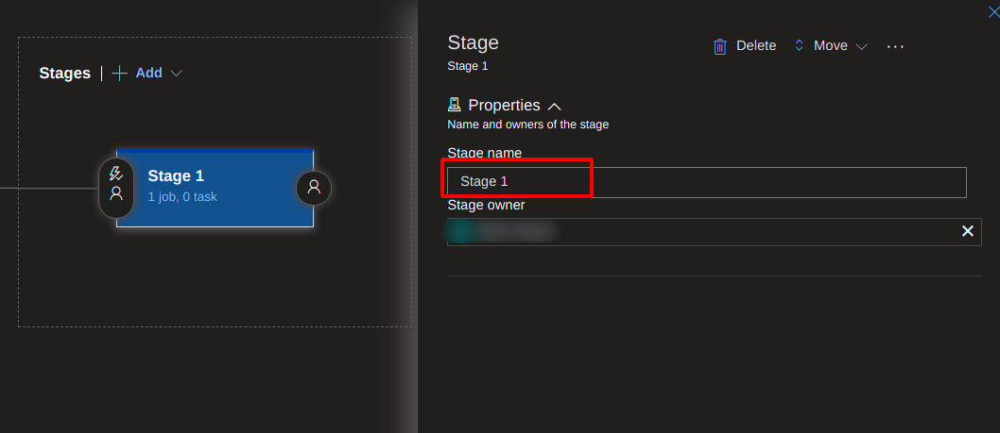
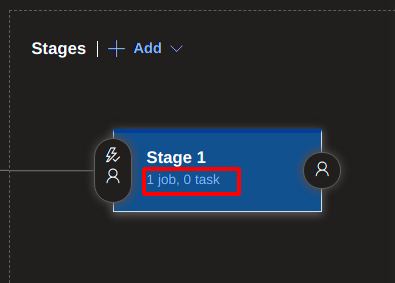

# Azure DevOps CI-CD Guide

## Prerequisite
- Existing Azure DevOps Project

## ➡️ Walkthrough for the CI

### **Navigate to existing project and click on the pipeline button to create the CI Pipeline.**
 

### **Click on New Pipeline**

#### It'll open up stage process, follow the snapshots to create pipeline

- Select the Azure repos git option which will lead to selection of the project repository.

    

- Select the repository

     

- You'll have to choose from the following two options:
  - Starter Pipeline: Which will create **azure-pipelines.yml** file in your repository with few startup steps
  - Choose existing: Select this one when you have **azure-pipelines.yml** already configured.

  - ✅ I'm using starter pipeline in upcoming configuration for more insights.
    

- If starter is selected, you'll be given starter yml template for azure pipeline which will look like the following:

    - Also note the highlighted area **Show assistant**, From here you can select various task for your needs. (i.e docker, ECR Pull or Push etc.)
    

### 🏁 At this point CI Pipeline configuration is done. For how to create pipelines as per your needs you may have to look up the examples.

## ➡️ Walkthrough for the CD

- To create CD, Click on the Release as shown in snapshot.
    
    

- Click on create release pipeline
    
    

- You'll be prompted to select a stage task, select empty job to start from the scratch.
  
    

- You'll have to choose artifacts to deploy the app through CD. Artifacts are basically are the dependencies those are needed at deployment time, also it can be a repository or drop or Build artifact generated from CI Pipeline.
  
    

- Here you can set your stage name which will be displayed at the release page. (i.e dev, prod, stage etc.)
  
    

- Once the naming is done, you'll have to setup set of tasks in the stage.
    
    

- You'll be redirected to the particular stage dashboard. Click on ➕ to add job tasks.
  
    

- You'll be prompted to select a tasks from the sidebar menu. (i.e helm task, deploy to app service etc.)
  
    

- Select the task as per your need and configure it.

⚠️Note: You can configure variables in from the variable menu for different stage. You can use them in any task by using **$(var_name)** syntax.

  
### Below is the example that deploys the app to the Kubernetes cluster using Helm.
  
- Overall Configuration:
  
    

- Stage Configuration - Helm install:
  - It'll install Helm tool in the Agent System.

    

- Stage Configuration - Download Helm chart:
  - It'll download the helm chart which is stored at S3 Storage.
  
    

- Stage Configuration - Helm Upgrade:
  - It'll start deploying or upgrading the specified helm chart to the Kubernetes cluster
  
    
    
  - More task configurations continues:

        

     

### 🏁 At this point CD Pipeline configuration is done. For how to create pipelines as per your needs you may have to look up the examples.