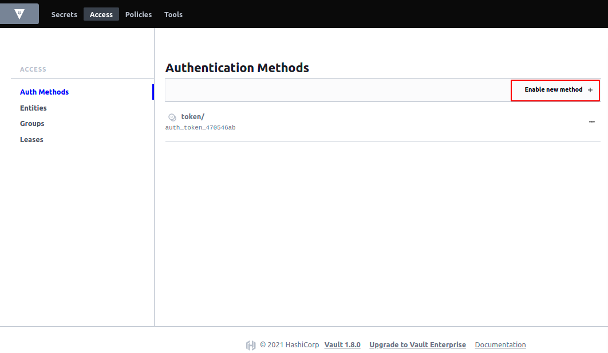

# Configure Hashicorp vault in Kubernetes

## 💡 This guide shows you how to install Vault in Kubernetes with any cloud providers.

### Steps:

- Download Hashicorp Vault Helm chart
  
  ```bash
  helm repo add hashicorp https://helm.releases.hashicorp.com
  helm repo update
  helm pull hashicorp/vault
  ```
    > This will add the helm repo and download the vault chart 

- Edit the ```values.yaml``` to add ingress configuration, by enabling ingress you can configure or access Vault using it's UI mode
  
  ```yaml
  ingress:
    enabled: true
    labels: {}
      # traffic: external
    annotations:
      kubernetes.io/ingress.class: nginx
      # |
      # kubernetes.io/ingress.class: nginx
      # kubernetes.io/tls-acme: "true"
      #   or
      # kubernetes.io/ingress.class: nginx
      # kubernetes.io/tls-acme: "true"

    # When HA mode is enabled and K8s service registration is being used,
    # configure the ingress to point to the Vault active service.
    activeService: true
    hosts:
      - host: # URL to access. for ex vault.myorg.com
        paths: []
    ## Extra paths to prepend to the host configuration. This is useful when working with annotation based services.
    extraPaths: []
    # - path: /*
    #   backend:
    #     serviceName: ssl-redirect
    #     servicePort: use-annotation
    tls: []
    #  - secretName: chart-example-tls
    #    hosts:
    #      - chart-example.local
  ```

- Now that it is configured, install the helm chart
  
  ```bash
    helm install vault hashicorp/vault \
    --set='server.ha.enabled=true' \
    --set='server.ha.raft.enabled=true'\
    --set='server.ha.replicas=1'
  ```

    > Here replica is intentionally kept to 1 for testing purposes.

- Once the pods are in running state, open the URL that is configured in ingress to Explore Vault UI.

    > Select Create new Raft Cluster and click next


   


- For the demonstration purpose, I've kept Key shares and threshold to 1
  
  


- Download the keys, Those keys will help us to unseal the vault
  
  


- Pass the key with the base64 in the input box.
  
  


- Now login with the token that is given in the key file, it is named as "root_token"
  
  

- Enable KV engine to store Key Value paired secrets.
  
  

- Select KV and Click Next
  
  

- Click on Enable Engine
  
  

- Now that the engine is enabled, create some secrets to store
  
  

  

  > Click on Save

- Now that the sample secrets are created, to integrate with Kubernetes we need to enable it. Which can be done in Authentication Methods
  
  

- Select Kubernetes 
  
  
  
  > Click on Next

- Enable Authentication method
  
  

- Add required details to configure kubernetes
  - Kubernetes host

    ```bash
    echo "https://$( kubectl exec vault-0 -- env | grep KUBERNETES_PORT_443_TCP_ADDR| cut -f2 -d'='):443"    
    ```
    > Enter the output in the input box

  - Kubernetes CA Certificate 

    ```bash
    kubectl exec vault-0 -- cat /var/run/secrets/kubernetes.io/serviceaccount/ca.crt
    ``` 

    > Enter the output in the input box and make sure toggle the enter as text.

  - Token Reviewer JWT 

    ```bash
    echo $(kubectl exec vault-0 -- cat /var/run/secrets/kubernetes.io/serviceaccount/token)
    ```

    > Enter the output in the input box and select save

- Now that most of configuration is done, last step is that we need to create ACL Policies

  

    ```
   # Read the configuration secret
    path "kv/data/webapp/creds" {
        capabilities = ["read"]
    }
   ```

   > Copy this into policy field and select create policy.

   


- Update the Kubernetes authentication method and add roles.
     

    Create new role

    

- Add the new role
    - You need to create service account in the kubernetes and attach it in **Bound Service account name** and also provide the namespace of that service account in **Bound service account namespaces**. 

    - To create the service role:

        ```bash
        kubectl apply -f -<<EOF 
        apiVersion: v1
        kind: ServiceAccount
        metadata:
        namespace: vault
        name: internal-app
        EOF
        ```
    - Also **Don't Forget to add Generated Token's Policies in Token Section**.

    - Add the **webappacl**  which was created in Access Policy early in the guide.

## Here Vault Setup is completely done. To Inject vault agent in Kubernetes deployment please check the following references:
---

## Agent Sidecar Injector
https://www.vaultproject.io/docs/platform/k8s/injector

## Agent Sidecar Annotations
https://www.vaultproject.io/docs/platform/k8s/injector/annotations
